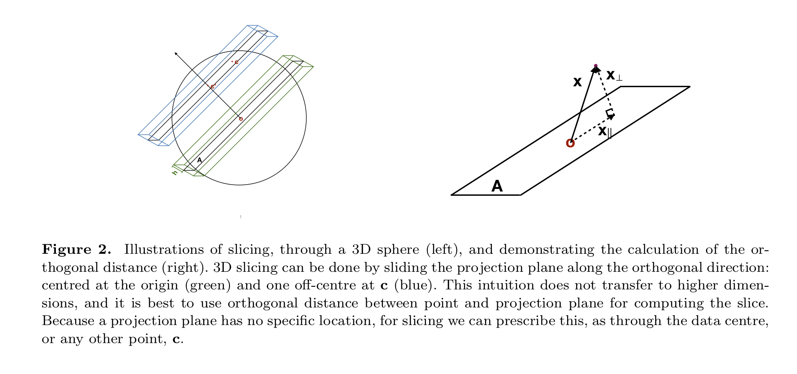

A slice tour for finding hollowness in high-dimensional data
================
Ursula Laa, **Di Cook**, German Valencia, Andreas Buja
March 12, 2020

<!-- README.md is generated from README.Rmd. Please edit that file -->

## Tour review

A tour provides a continuous sequence of \(d\)-dimensional (typically
\(d=1\) or \(2\)) projections from \(p\)-dimensional Euclidean space. It
is constructed by combining a method for basis selection with geodesic
interpolation between pairs of bases. In a grand tour, the basis
selection is random, each new basis is chosen from all possible
projections. In a guided tour, the bases are chosen based on an index of
interestingness. Different basis selection methods as well as the
geodesic interpolation are implemented in the `tourr` package, which
also provides several display functions for viewing the tour.

*Let’s try it*

``` r
library(tidyverse)
library(tourr)
library(MASS)
data(flea)
flea_pca <- prcomp(flea[,1:6], scale = TRUE)
flea_pca$x %>% 
  as_tibble() %>% 
  ggplot(aes(x=PC1, y=PC2)) +
     geom_point() +
     theme(aspect.ratio = 1)
flea_pca$rotation[,1:2]
biplot(flea_pca)
flea_lda <- lda(species~., data=flea)
flea_ld <- predict(flea_lda, flea)$x %>%
  as_tibble() %>%
  mutate(species = flea$species)
ggplot(flea_ld, aes(x=LD1, y=LD2, colour=species)) + 
  geom_point() +
     theme(aspect.ratio = 1)
flea_lda$scaling
# This requires dynamic plotting
quartz() # on the mac, but on Windows you can either use X11() or nothing, I think
animate_xy(flea[, 1:6], axes = "bottomleft")
library(RColorBrewer)
clrs <- brewer.pal(3, "Dark2")
col <- clrs[as.numeric(flea$species)]
animate_xy(flea[, 1:6], axes = "bottomleft", col=col)
```

## A slice tour

### Some high-dimensional geometric shapes

Let’s go for a walk into deep space

  - Spheres in 4D

<!-- end list -->

``` r
nPt <- 5000
library(geozoo)
d1 <- data.frame(sphere.solid.random(4, nPt)$points)
animate_xy(d1, axes = "bottomleft")

d2 <- data.frame(sphere.hollow(4, nPt)$points)
animate_xy(d2, axes = "bottomleft")
```

  - Cubes

<!-- end list -->

``` r

d3 <- cube.solid.random(4)$points[1:nPt,] %>% 
  data.frame() %>%
  mutate_all(function(x) x-0.5)
animate_xy(d3, axes = "bottomleft")

d4 <- cube.face(4)$points[1:nPt,] %>% scale(scale = FALSE) %>% 
  data.frame() %>%
  mutate_all(function(x) x-0.5)
animate_xy(d4, axes = "bottomleft")
```

  - Roman surface

<!-- end list -->

``` r
rms <- roman.surface()$points %>%
  scale() %>% data.frame()
animate_xy(rms, axes = "bottomleft")
```

  - Torus

<!-- end list -->

``` r
torus3 <- torus(p=3)$points %>%
  scale() %>% data.frame()
animate_xy(torus3, axes = "bottomleft")

torus4 <- torus(p=4)$points %>%
  scale() %>% data.frame()
animate_xy(torus4, axes = "bottomleft")
```

### When projections are not enough

  - Is this hollow or solid?

<!-- end list -->

``` r
load("mystery1.rda")
animate_xy(mystery1, axes = "bottomleft")
```

  - Is there anything special about this data?

<!-- end list -->

``` r
library(animation)
data(pollen)
pollen <- as.matrix(pollen) %>% scale()
animate_xy(pollen, axes = "bottomleft")
```

### Slicing procedures



*Let’s look at the previous examples using the slice tour*

``` r
animate_slice(mystery1, axes = "bottomleft")
animate_slice(pollen, axes = "bottomleft", half_range=0.5, eps=0.0005)
animate_slice(pollen, axes = "bottomleft", half_range=0.15, eps=0.0005)
```

## How can we use this?

Looking at the boundaries induced by a classification model

``` r
wine_radial <- read_csv("wine-svm-radial.csv")
wine_radial <- wine_radial %>% 
  group_by(type) %>%
  sample_frac(0.5)

col <- clrs[as.numeric(as.factor(wine_radial$type))]
wine_radial_scaled <- data.frame(scale(as.matrix(wine_radial[,1:3])))
animate_xy(wine_radial_scaled, axes = "bottomleft", col=col)
animate_slice(wine_radial_scaled, axes = "bottomleft", col=col, eps=0.05)

wine_poly <- read_csv("wine-svm-poly.csv")
col <- clrs[as.numeric(as.factor(wine_poly$type))]
wine_poly_scaled <- data.frame(scale(as.matrix(wine_poly[,1:5])))
animate_xy(wine_poly_scaled, axes = "bottomleft", col=col)
animate_slice(wine_poly_scaled, axes = "bottomleft", col=col, eps=0.01)
```
